# **Circuit Chronicles**

- Circuit Chronicles is a blog where people can visit to get any tips, tricks or information about electricity or electrical components from verified sources.

- Live website
[Circuit Chronicles](https://circuit-chronicle-9b73c77b4dab.herokuapp.com)

## **Table of Contents**

* [Design](#design)
* [User Stories](#user-stories)
* [Features](#features)
* [Entity-diagram](#entity-diagram)
* [Agile developement](#agile-developement)
* [Database](#database)
* [CRUD](#crud)
* [Deployment](#deployment)
* [Testing](#testing)
* [Credits](#credits)

# Design
## Colours
The colours chosen for the project are those that spring to mind when think about electricity, with warning symbols being both red and yellow.

## Images
The images chosen are those of both electricians working and the components that may be link with certain jobs in the electrical field.

# User Stories
- As a user I want to register an account.
- As a user I want to like a post I'm interested in.
- As a user I want to leave a comment on a post to leave my opinion.
- As a user I want to leave a message to get the opportunity to work with the website and leave a post.
- As a user I want to scroll through posts and see a brief overview.

- As a Admin I want to moderate, approve or delete posts.
- As a Admin I want to approve or decline comments.
- As a Admin I want to accept or decline new users.
- As a Admin I want to view messages that have been sent to me.

# Features

## Navigation bar

- Gives the options to go to different pages for contact us, register for a new account or sign-in with your existing information.

## Contact us

- Create a form with a message so that the superuser of the page can see what post you want to work on.

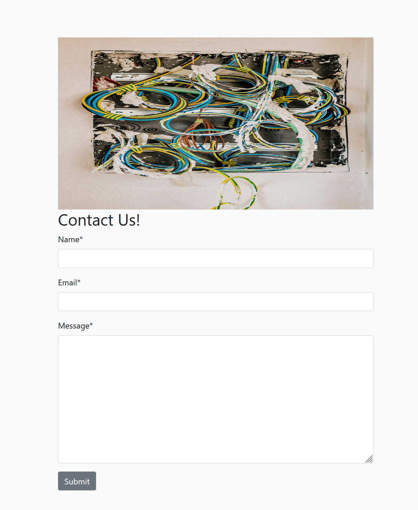

## Home page

- Browse through posted blogs with author names and exercpts of what the article is about.

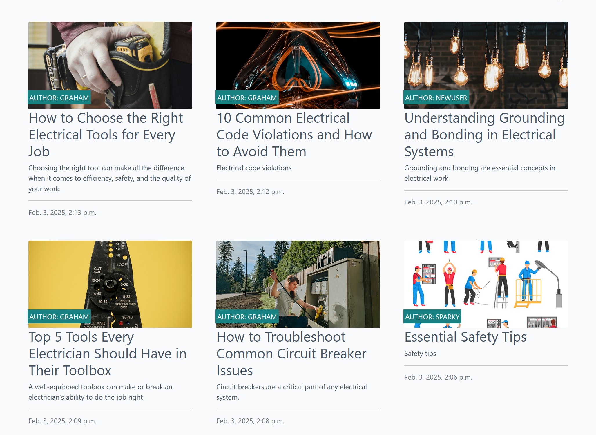

- Select a blog to read.

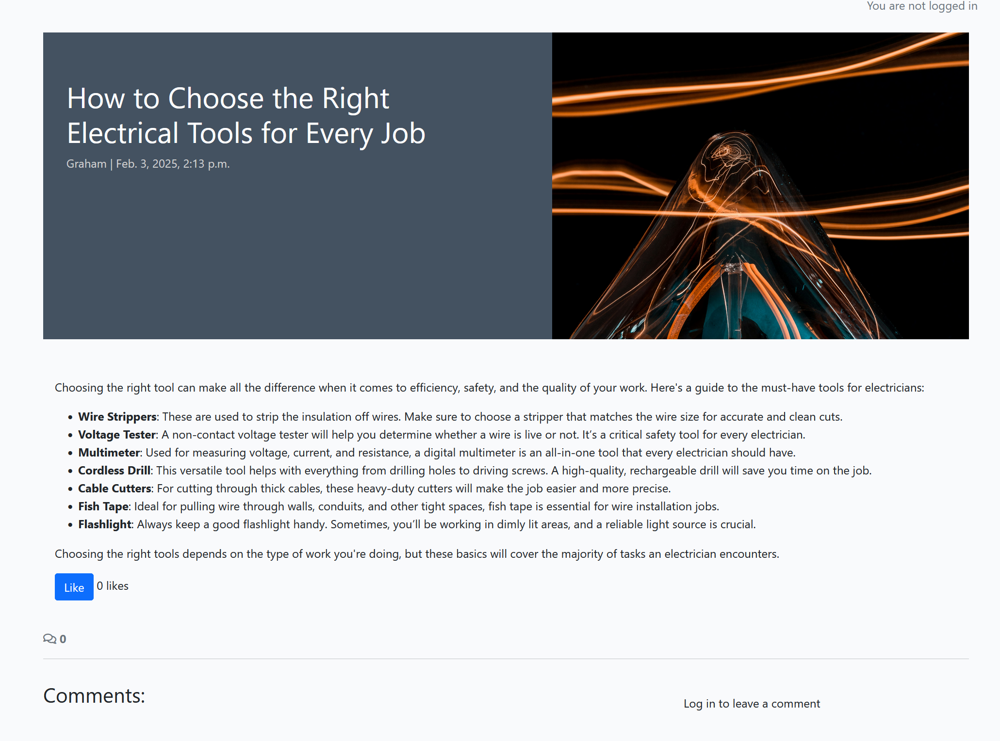

## Comments and Likes

- Add your thoughts on the topic through a comment or a like.

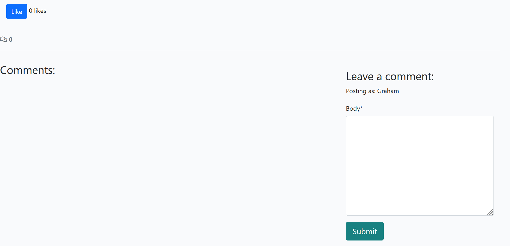

- Must be logged in

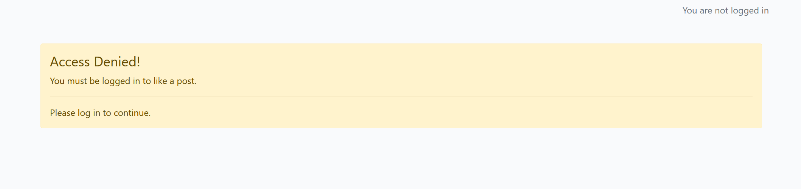

## Sign-in page

- Sign-in page to log yourself in using credentials on the database.

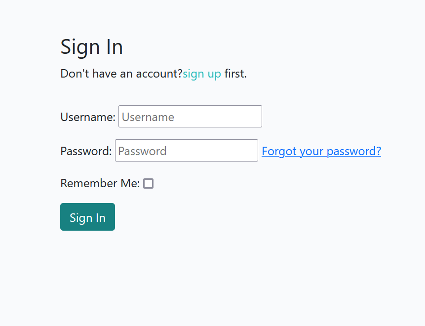

## Sign-up page

- Sign-up page to create new information for a new user.

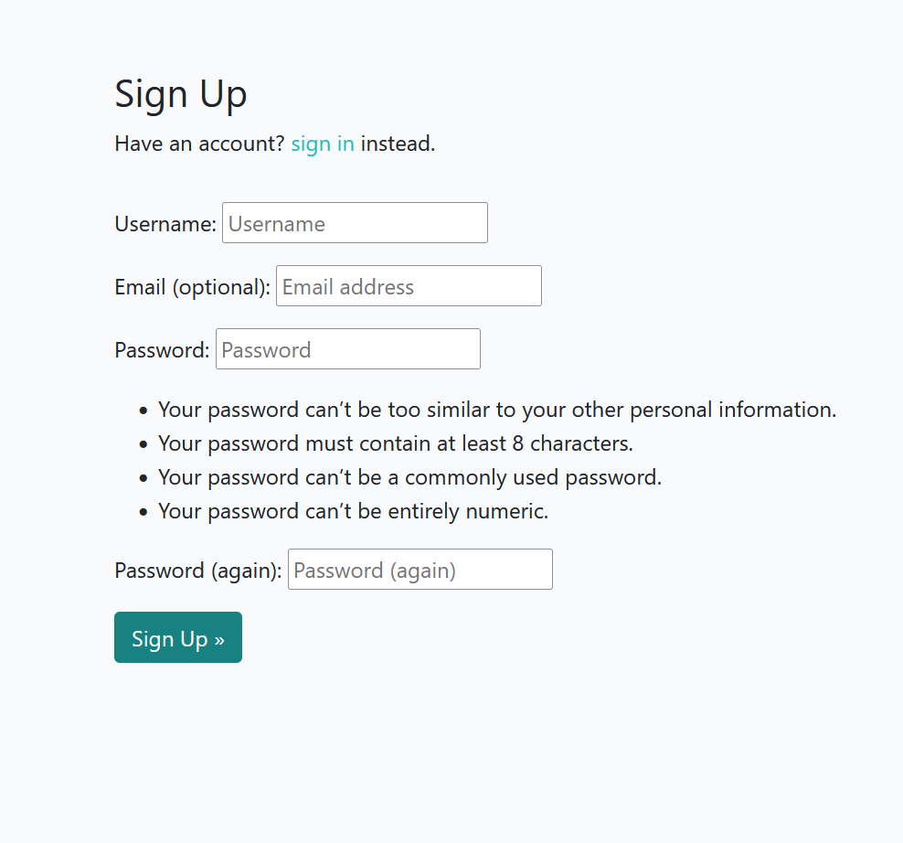

## Sign-out question and message

- Message asking if you want to sign-out.

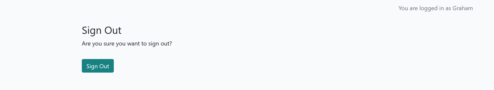

- Successful sign-out message.

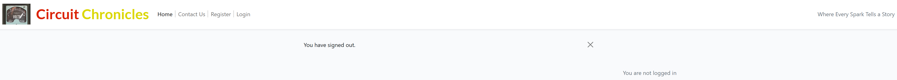

# Entity-diagram
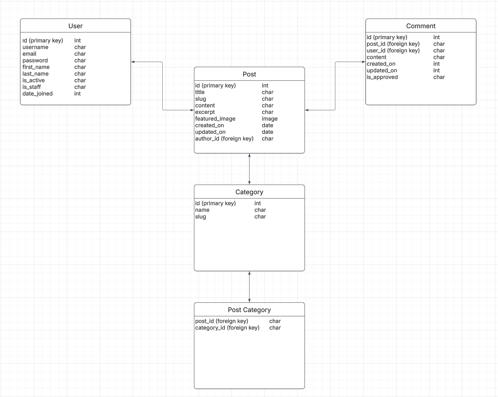

# Agile developement
- Developed using the agile method.
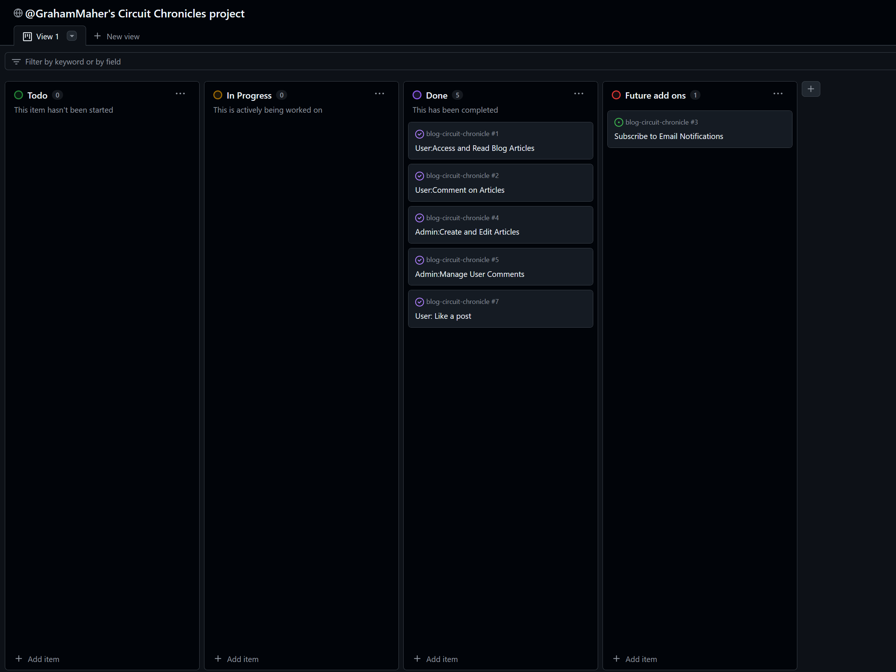

# Database
- Database used was postgres sql

# CRUD 
- Superuser can post, edit posts, moderate, approve and decline.
- Users can view posts, comment and like, in order to post a message must be sent in and approved, a draft may be sent through where the superuser will post and add credit.

# Deployment
- Project was deployed on Heroku.
  - Log into Heroku.
  - Create new app and select the region and a unique name.
  - Link to Github repo.
  - In Settings, Config Vars, add the database and key, add environment varibles and keys, add config key and values,    Disable_collectstatic.

# Testing
## Manual Testing
### Sign-up
| Test | Result |
|--|--|
| User can sign-up with a valid email | Pass |
| User can sign-up with a strong password, following the guide lines | Pass |
| User must enter valid information or else registration won't be successful | Pass |

---

### Sign-in
| Test | Result |
|--|--|
| User must enter correct details in order to sign-in to profile | Pass |
| Incorrect details don't allow sign-in | Pass |

---

### Contact us
| Test | Result |
|--|--|
| User can submit a message and the superuser can see it | Pass |
| Information must be entered before form can be submitted | Pass |

---

### View Blog Posts
| Test | Result |
|--|--|
| User can access posts that have been written from the homepage. | Pass |
| User can easily scroll and browse through the page and view exercpts | Pass |
| Only logged in users can post a comment or like. | Pass |

---

### Authentication
| Test | Result |
|--|--|
| Only the superuser can access the admin page| Pass |
| Admin can view posts and comments to approve before posting | Pass |

# Credits
- Code Institute I think therefore I blog - basic code
- Unsplash - Images
- Djangoproject - Django documents
- W3school - Coding help
- Realpython - Guidance on creating a blog
- Geeksforgeeks.org - reference for code